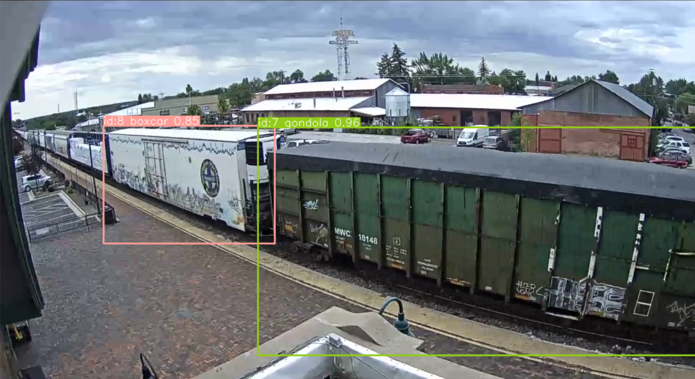

# Railcar Tracker
Railcar Tracker is a tool to count railcars and classify them.

### Usage
```python
from railcar_tracker import count_objects

counter, railcars = count_objects(model_path, video_path, **kwargs)
```

### Detection


### Counting
```python
Counter({'tank': 33, 'boxcar': 28, 'hopper': 27, 'gondola': 8, 'locomotive': 5})
```